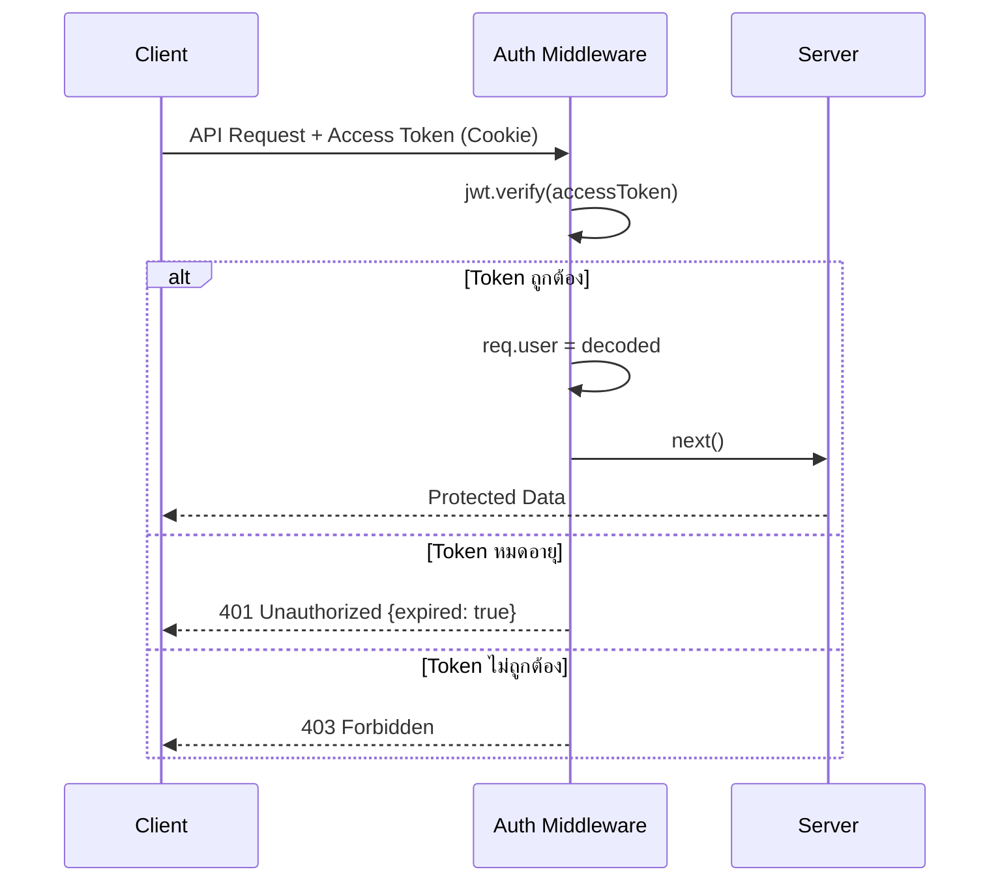
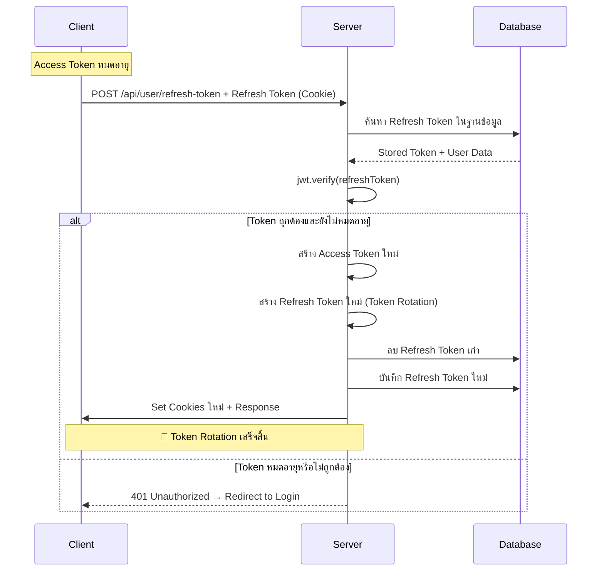
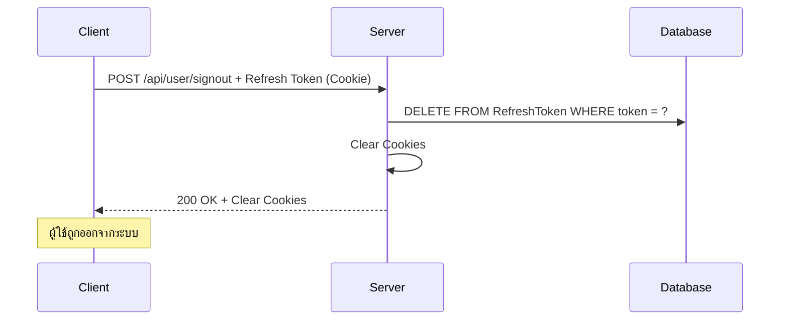

# Token และ Session Management Documentation

## 📖 บทนำ

ระบบการจัดการ Token และ Session เป็นหัวใจสำคัญของการรักษาความปลอดภัยในเว็บแอปพลิเคชัน โดยใช้หลักการของ **JWT (JSON Web Token)** ร่วมกับ **Dual Token Strategy** (Access Token + Refresh Token) เพื่อให้ผู้ใช้สามารถเข้าใช้งานระบบได้อย่างปลอดภัยและสะดวก

---

## 🔑 ทำไมต้องใช้ Access Token และ Refresh Token

### 🎯 ปัญหาของการใช้ Token เดียว
```
❌ ถ้าใช้ Token เดียวที่มีอายุยาว:
- หาก Token ถูกขโมย จะถูกใช้งานได้นาน
- ไม่สามารถยกเลิก Token ได้ (เพราะ JWT เป็น stateless)
- ความเสี่ยงด้านความปลอดภัยสูง

❌ ถ้าใช้ Token เดียวที่มีอายุสั้น:
- ผู้ใช้ต้อง login บ่อยมาก
- User Experience แย่
- ใช้งานไม่สะดวก
```

### ✅ วิธีแก้ปัญหาด้วย Dual Token Strategy

```
🟢 Access Token (อายุสั้น - 1 ชั่วโมง):
- ใช้สำหรับเข้าถึง API ที่ต้องการ authentication
- หากถูกขโมยจะใช้งานได้เพียงระยะเวลาสั้น
- มีความปลอดภัยสูง

🔵 Refresh Token (อายุยาว - 7 วัน):
- ใช้สำหรับสร้าง Access Token ใหม่
- เก็บในฐานข้อมูลเพื่อควบคุมการใช้งาน
- สามารถยกเลิกได้ (revoke)
- มี Token Rotation เพื่อความปลอดภัย
```

---

## 🏗️ สถาปัตยกรรมระบบ

### 📊 ส่วนประกอบหลัก

```
┌─────────────────┐    ┌─────────────────┐    ┌─────────────────┐
│   Frontend      │    │   Backend       │    │   Database      │
│   (React/Next)  │    │   (Express.js)  │    │   (MongoDB)     │
├─────────────────┤    ├─────────────────┤    ├─────────────────┤
│ • Login Form    │◄──►│ • UserController│◄──►│ • User Model    │
│ • API Calls     │    │ • Auth Middleware│    │ • RefreshToken  │
│ • Token Handler │    │ • CSRF Protection│    │   Model         │
│ • Auto Refresh  │    │ • Cookie Management│    │ • Indexes       │
└─────────────────┘    └─────────────────┘    └─────────────────┘
```

### 🗃️ Database Schema

```prisma
model User {
  id            String         @id @default(auto()) @map("_id") @db.ObjectId
  refreshTokens RefreshToken[] // One-to-Many relationship
  username      String         @unique
  password      String         // bcrypt hashed
  name          String
  level         String         @default("user")
  status        String         @default("active")
}

model RefreshToken {
  id        String   @id @default(auto()) @map("_id") @db.ObjectId
  token     String   @unique              // JWT refresh token
  userId    String   @db.ObjectId         // Foreign key
  user      User     @relation(fields: [userId], references: [id], onDelete: Cascade)
  expiresAt DateTime                      // Expiration timestamp
  createdAt DateTime @default(now())

  @@index([userId])  // Index for performance
}
```

---

## 🔄 Flow การทำงานแบบละเอียด - เข้าใจง่าย

> **💡 สำคัญ:** ส่วนนี้จะอธิบายการทำงานของระบบ Authentication ตั้งแต่เริ่มต้นจนจบ โดยแบ่งเป็นขั้นตอนที่เข้าใจง่าย

---

### 🎯 ภาพรวมการทำงานทั้งระบบ

ก่อนที่จะเจาะลึกในแต่ละขั้นตอน มาดูภาพรวมการทำงานกันก่อน:

```
📱 ผู้ใช้ → 🔐 Login → ✅ รับ Tokens → 🛡️ เข้าถึงข้อมูล → 🔄 ต่ออายุ Token → 🚪 Logout
```

**อธิบายง่ายๆ:**
1. **ผู้ใช้กรอก username/password** → ระบบตรวจสอบ
2. **ถ้าถูกต้อง** → ระบบให้ "บัตรผ่าน" 2 ใบ (Access Token + Refresh Token)
3. **ใช้บัตรผ่านเข้าถึงข้อมูล** → ระบบตรวจสอบบัตรก่อนให้เข้า
4. **เมื่อบัตรใกล้หมดอายุ** → ระบบออกบัตรใหม่ให้อัตโนมัติ
5. **เมื่อออกจากระบบ** → ระบบยกเลิกบัตรทั้งหมด

---

### 1️⃣ การ Login (เข้าสู่ระบบ) - อธิบายทีละขั้นตอน

**🤔 สิ่งที่เกิดขึ้นเมื่อผู้ใช้กด "เข้าสู่ระบบ"**

#### ขั้นตอนที่ 1: ผู้ใช้ส่งข้อมูล
```
ผู้ใช้กรอก: 
├── Username: "john_doe"
└── Password: "mypassword123"

จากนั้นกดปุ่ม "Login" ↓
```

#### ขั้นตอนที่ 2: ระบบตรวจสอบข้อมูล
```
🔍 Server ทำงาน:
1. ไปหาใน Database ว่ามี username "john_doe" หรือไม่?
2. ถ้าเจอ → เอารหัสผ่านที่เข้ารหัสแล้วมาเปรียบเทียบ
3. ใช้ bcrypt.compare() ตรวจสอบว่า "mypassword123" ตรงกับในฐานข้อมูลไหม?
```

#### ขั้นตอนที่ 3A: ถ้ารหัสผ่านถูกต้อง ✅
```
🎉 ระบบทำการ:
1. สร้าง "บัตรประจำตัว" 2 ใบ:
   ├── 🔴 Access Token (อายุ 1 ชั่วโมง) = บัตรสำหรับใช้งานทันที
   └── 🔵 Refresh Token (อายุ 7 วัน) = บัตรสำหรับต่ออายุ

2. เก็บ Refresh Token ไว้ในฐานข้อมูล (เพื่อควบคุมการใช้งาน)

3. ส่งบัตรให้ผู้ใช้ผ่าน "Cookies" (ที่เป็นความลับ)
   ├── Cookie: accessToken = "eyJhbGciOiJIUzI1NiIs..."
   └── Cookie: refreshToken = "eyJhbGciOiJIUzI1NiIs..."

4. ส่งข้อมูลผู้ใช้กลับไป
   └── Response: { user: { id, name, level }, csrfToken }
```

#### ขั้นตอนที่ 3B: ถ้ารหัสผ่านผิด ❌
```
🚫 ระบบตอบกลับ:
├── สถานะ: 401 Unauthorized
├── ข้อความ: "Username หรือ Password ไม่ถูกต้อง"
└── ผู้ใช้ต้องลองใหม่
```

#### 📋 Code ตอนจริงที่เกิดขึ้น:

```javascript
// ที่ UserController.js - signIn function
async signIn(req, res) {
  const { username, password } = req.body;
  
  // 🔍 ขั้นตอนที่ 2: หาผู้ใช้ในฐานข้อมูล
  const user = await prisma.user.findUnique({
    where: { username }
  });
  
  if (!user) {
    return res.status(401).json({ message: "Username หรือ Password ไม่ถูกต้อง" });
  }
  
  // 🔐 ขั้นตอนที่ 2: เปรียบเทียบรหัสผ่าน
  const validPassword = await bcrypt.compare(password, user.password);
  
  if (!validPassword) {
    return res.status(401).json({ message: "Username หรือ Password ไม่ถูกต้อง" });
  }
  
  // ✅ ขั้นตอนที่ 3A: สร้าง Tokens
  const userData = { id: user.id, level: user.level };
  const accessToken = jwt.sign(userData, process.env.ACCESS_TOKEN_SECRET, { expiresIn: "1h" });
  const refreshToken = jwt.sign(userData, process.env.REFRESH_TOKEN_SECRET, { expiresIn: "7d" });
  
  // 💾 เก็บ Refresh Token ในฐานข้อมูล
  await prisma.refreshToken.create({
    data: { 
      token: refreshToken, 
      userId: user.id 
    }
  });
  
  // 🍪 ส่ง Cookies ให้ผู้ใช้
  res.cookie("accessToken", accessToken, {
    httpOnly: true,    // ป้องกัน JavaScript เข้าถึง
    secure: true,      // ใช้ได้เฉพาะ HTTPS
    sameSite: "strict", // ป้องกัน CSRF
    path: '/'          // ใช้ได้ทั้งเว็บไซต์
  });
  
  res.cookie("refreshToken", refreshToken, {
    httpOnly: true,
    secure: true,
    sameSite: "strict",
    path: '/'
  });
  
  // 📤 ส่งข้อมูลผู้ใช้กลับไป
  res.json({
    user: { id: user.id, name: user.name, level: user.level },
    csrfToken: generateCSRFToken()
  });
}
```

---

### 2️⃣ การเข้าถึงข้อมูล (Protected Routes) - มีบัตรประจำตัวมั้ย?

**🤔 สิ่งที่เกิดขึ้นเมื่อผู้ใช้พยายามเข้าถึงข้อมูลที่ต้องการสิทธิ์**

#### ขั้นตอนที่ 1: ผู้ใช้ขอข้อมูล
```
ผู้ใช้เรียกใช้ API: GET /api/user/dashboard
↓
🍪 Browser ส่ง Cookies ไปพร้อมกับ Request
├── Cookie: accessToken="eyJhbGciOiJIUzI1NiIs..."
└── Cookie: refreshToken="eyJhbGciOiJIUzI1NiIs..."
```

#### ขั้นตอนที่ 2: Middleware ตรวจสอบ
```
🛡️ Authentication Middleware ทำงาน:

1. ดึง accessToken จาก Cookie
   ├── มี Token ไหม? → ถ้าไม่มี = ปฏิเสธทันที
   └── มี Token → ไปขั้นตอนต่อไป

2. ตรวจสอบ Token ว่าถูกต้องไหม?
   ├── jwt.verify(token, SECRET_KEY)
   ├── ตรวจสอบลายเซ็น
   ├── ตรวจสอบวันหมดอายุ
   └── ถอดรหัสข้อมูลผู้ใช้

3. ผลการตรวจสอบ:
   ├── ✅ Token ถูกต้อง → อนุญาตให้เข้าถึง
   └── ❌ Token ผิด/หมดอายุ → ปฏิเสธ
```

#### ขั้นตอนที่ 3A: ถ้า Token ถูกต้อง ✅
```
🎉 ระบบอนุญาต:
1. เพิ่มข้อมูลผู้ใช้เข้าไปใน req.user
   └── req.user = { id: 123, level: "admin" }

2. ส่งต่อไปยัง Controller ปลายทาง
   └── เช่น getUserDashboard()

3. Controller ส่งข้อมูลที่ขอกลับมา
   └── Response: { data: "ข้อมูลผู้ใช้..." }
```

#### ขั้นตอนที่ 3B: ถ้า Token ผิดหรือหมดอายุ ❌
```
🚫 ระบบปฏิเสธ:
├── สถานะ: 401 Unauthorized
├── ข้อความ: "Token ไม่ถูกต้องหรือหมดอายุ"
└── ผู้ใช้ต้อง Login ใหม่ หรือต่ออายุ Token
```

#### 📋 Code ตัวอย่าง Middleware:
```javascript
// ที่ middleware/auth.js
function authenticateToken(req, res, next) {
  // 🍪 ขั้นตอนที่ 1: ดึง Token จาก Cookie
  const token = req.cookies.accessToken;
  
  if (!token) {
    return res.status(401).json({ message: "ไม่พบ Access Token" });
  }
  
  try {
    // 🔍 ขั้นตอนที่ 2: ตรวจสอบ Token
    const decoded = jwt.verify(token, process.env.ACCESS_TOKEN_SECRET);
    
    // ✅ ขั้นตอนที่ 3A: Token ถูกต้อง
    req.user = decoded; // เก็บข้อมูลผู้ใช้ไว้ใน req
    next(); // ส่งต่อไปยัง Controller
    
  } catch (error) {
    // ❌ ขั้นตอนที่ 3B: Token ผิด
    return res.status(401).json({ message: "Token ไม่ถูกต้อง" });
  }
}
```

---

### 3️⃣ การต่ออายุ Token (Refresh Token) - บัตรใกล้หมดอายุแล้ว!

**🤔 สิ่งที่เกิดขึ้นเมื่อ Access Token หมดอายุแต่ผู้ใช้ยังต้องการใช้งานต่อ**

#### สถานการณ์ที่เกิดขึ้น:
```
⏰ Access Token หมดอายุแล้ว!
├── ผู้ใช้ไม่รู้ (ยังคิดว่าล็อกอินอยู่)
├── เมื่อเรียก API → ได้ 401 Unauthorized
└── Frontend ต้องจัดการด้วยการต่ออายุ Token อัตโนมัติ
```

#### ขั้นตอนที่ 1: Frontend ตรวจจับปัญหา
```javascript
// ที่ Frontend - เมื่อได้รับ 401
fetch('/api/user/dashboard')
  .then(response => {
    if (response.status === 401) {
      // 🔄 Access Token หมดอายุ → ลองต่ออายุ
      return refreshTokens();
    }
  });
```

#### ขั้นตอนที่ 2: ระบบต่ออายุ Token
```
🔄 การต่ออายุ Token ทำงาน:

1. ดึง refreshToken จาก Cookie
   ├── มี Refresh Token ไหม?
   └── ถ้าไม่มี → ต้อง Login ใหม่

2. ตรวจสอบ Refresh Token
   ├── jwt.verify(refreshToken, REFRESH_SECRET)
   ├── ตรวจสอบว่า Token ยังไม่หมดอายุ
   └── ค้นหาในฐานข้อมูลว่ามี Token นี้ไหม?

3. ถ้าทุกอย่างถูกต้อง:
   ├── สร้าง Access Token ใหม่
   ├── สร้าง Refresh Token ใหม่
   ├── ลบ Refresh Token เก่าออก
   ├── เก็บ Refresh Token ใหม่
   └── ส่ง Cookies ใหม่กลับไป
```

#### ขั้นตอนที่ 3A: ต่ออายุสำเร็จ ✅
```
🎉 ระบบต่ออายุสำเร็จ:
1. ส่ง Cookies ใหม่:
   ├── accessToken (ใหม่ - อายุ 1 ชั่วโมง)
   └── refreshToken (ใหม่ - อายุ 7 วัน)

2. ส่งข้อมูลผู้ใช้กลับมา
   └── { user: {...}, csrfToken: "..." }

3. Frontend ลอง Request เดิมอีกครั้ง
   └── ตอนนี้ใช้ Access Token ใหม่ได้แล้ว!
```

#### ขั้นตอนที่ 3B: ต่ออายุไม่สำเร็จ ❌
```
🚫 เหตุผลที่ต่ออายุไม่ได้:
├── Refresh Token หมดอายุ (เกิน 7 วัน)
├── Refresh Token ถูกลบออกจากฐานข้อมูล (Logout แล้ว)
├── Refresh Token ถูกแก้ไข (ไม่ถูกต้อง)
└── ผลลัพธ์: ต้อง Login ใหม่ทั้งหมด
```

#### 📋 Code ตัวอย่าง Refresh Token:
```javascript
// ที่ UserController.js - refreshToken function
async refreshToken(req, res) {
  // 🍪 ขั้นตอนที่ 1: ดึง Refresh Token
  const { refreshToken } = req.cookies;
  
  if (!refreshToken) {
    return res.status(401).json({ message: "ไม่พบ Refresh Token" });
  }
  
  try {
    // 🔍 ขั้นตอนที่ 2: ตรวจสอบ Refresh Token
    const decoded = jwt.verify(refreshToken, process.env.REFRESH_TOKEN_SECRET);
    
    // 📊 ค้นหาในฐานข้อมูล
    const storedToken = await prisma.refreshToken.findFirst({
      where: { token: refreshToken },
      include: { user: true } // ดึงข้อมูลผู้ใช้มาด้วย
    });
    
    if (!storedToken) {
      return res.status(401).json({ message: "Refresh Token ไม่ถูกต้อง" });
    }
    
    // ✅ ขั้นตอนที่ 3A: สร้าง Tokens ใหม่
    const userData = { 
      id: storedToken.user.id, 
      level: storedToken.user.level 
    };
    
    const newAccessToken = jwt.sign(userData, process.env.ACCESS_TOKEN_SECRET, { expiresIn: "1h" });
    const newRefreshToken = jwt.sign(userData, process.env.REFRESH_TOKEN_SECRET, { expiresIn: "7d" });
    
    // 🗑️ ลบ Token เก่า และเก็บ Token ใหม่
    await prisma.refreshToken.delete({ where: { id: storedToken.id } });
    await prisma.refreshToken.create({
      data: { token: newRefreshToken, userId: storedToken.user.id }
    });
    
    // 🍪 ส่ง Cookies ใหม่
    res.cookie("accessToken", newAccessToken, { httpOnly: true, secure: true, sameSite: "strict", path: '/' });
    res.cookie("refreshToken", newRefreshToken, { httpOnly: true, secure: true, sameSite: "strict", path: '/' });
    
    // 📤 ส่งข้อมูลผู้ใช้
    res.json({
      user: { id: storedToken.user.id, name: storedToken.user.name, level: storedToken.user.level },
      csrfToken: generateCSRFToken()
    });
    
  } catch (error) {
    // ❌ ขั้นตอนที่ 3B: ต่ออายุไม่ได้
    return res.status(401).json({ message: "Refresh Token หมดอายุหรือไม่ถูกต้อง" });
  }
}
```

---

### 4️⃣ การ Logout (ออกจากระบบ) - ทำลายบัตรประจำตัวทั้งหมด

**🤔 สิ่งที่เกิดขึ้นเมื่อผู้ใช้กด "ออกจากระบบ"**

#### ขั้นตอนที่ 1: ผู้ใช้ขอออกจากระบบ
```
ผู้ใช้กดปุ่ม "Logout" → POST /api/user/signout
↓
🍪 Browser ส่ง Cookies ไปด้วย (เพื่อระบุตัวตน)
```

#### ขั้นตอนที่ 2: ระบบลบข้อมูลที่เกี่ยวข้อง
```
🗑️ ระบบทำการลบ:

1. ลบ Refresh Token จากฐานข้อมูล
   └── DELETE FROM RefreshToken WHERE token = "..."

2. ลบ Cookies จาก Browser
   ├── res.clearCookie("accessToken")
   └── res.clearCookie("refreshToken")

3. ส่งสัญญาณยืนยันการออกจากระบบ
   └── { message: "ออกจากระบบสำเร็จ" }
```

#### ขั้นตอนที่ 3: ผลลัพธ์
```
✅ ผลลัพธ์การ Logout:
├── ไม่มี Cookies ใน Browser → ไม่สามารถเข้าถึงข้อมูลได้
├── ไม่มี Refresh Token ในฐานข้อมูล → ไม่สามารถต่ออายุได้
└── ผู้ใช้ต้อง Login ใหม่ถ้าต้องการใช้งาน
```

#### 📋 Code ตัวอย่าง Logout:
```javascript
// ที่ UserController.js - signOut function
async signOut(req, res) {
  // 🍪 ดึง Refresh Token จาก Cookie
  const { refreshToken } = req.cookies;
  
  if (refreshToken) {
    try {
      // 🗑️ ลบ Refresh Token จากฐานข้อมูล
      await prisma.refreshToken.deleteMany({
        where: { token: refreshToken }
      });
    } catch (error) {
      console.log("ลบ Refresh Token ไม่สำเร็จ:", error);
    }
  }
  
  // 🍪 ลบ Cookies ทั้งหมด
  res.clearCookie("accessToken", { path: '/' });
  res.clearCookie("refreshToken", { path: '/' });
  
  // ✅ ส่งสัญญาณยืนยัน
  res.json({ message: "ออกจากระบบสำเร็จ" });
}
```

---

### 🔄 สรุปภาพรวม Flow ทั้งหมด

```
🚀 การทำงานแบบครบวงจร:

1. 🔐 Login
   ├── Username + Password → ตรวจสอบ → สร้าง Tokens → ส่ง Cookies
   
2. 🛡️ เข้าถึงข้อมูล
   ├── ส่ง Cookies → ตรวจสอบ Access Token → อนุญาต/ปฏิเสธ
   
3. 🔄 ต่ออายุ Token
   ├── Access Token หมดอายุ → ใช้ Refresh Token → สร้าง Tokens ใหม่
   
4. 🚪 Logout
   ├── ลบ Refresh Token → ลบ Cookies → ออกจากระบบ

🔒 การรักษาความปลอดภัย:
├── 🍪 httpOnly Cookies (ป้องกัน XSS)
├── 🛡️ CSRF Protection
├── ⏰ Token หมดอายุ (จำกัดเวลาใช้งาน)
├── 🗑️ Token Cleanup (ลบ Token เก่าอัตโนมัติ)
└── 🔐 bcrypt Password Hashing
```

**🎯 ข้อดีของระบบนี้:**
- **ปลอดภัย:** ใช้ Token 2 ชั้น + หลายระดับการป้องกัน
- **สะดวก:** ผู้ใช้ไม่ต้อง Login บ่อย (มี Refresh Token)
- **ควบคุมได้:** สามารถยกเลิก Session ได้ทันที (ลบ Refresh Token)
- **อัตโนมัติ:** ต่ออายุ Token เองโดยผู้ใช้ไม่รู้สึก

---

### 2️⃣ การเข้าถึง Protected Resources



**Auth Middleware:**

```javascript
const authenticateToken = (req, res, next) => {
  const accessToken = req.cookies.accessToken;

  if (!accessToken) {
    return res.status(401).json({ message: 'Access token is missing' });
  }

  try {
    // ตรวจสอบความถูกต้องและการหมดอายุ
    const decoded = jwt.verify(accessToken, process.env.ACCESS_TOKEN_SECRET);
    req.user = decoded;  // 📝 เก็บข้อมูล user ไว้ใน request object
    next();
  } catch (error) {
    if (error.name === 'TokenExpiredError') {
      return res.status(401).json({ 
        message: 'Token หมดอายุ', 
        expired: true  // 🚨 บอก Frontend ให้ refresh token
      });
    }
    return res.status(403).json({ message: 'ไม่มีสิทธิ์เข้าถึง' });
  }
}
```

### 3️⃣ การ Refresh Token (Automatic Token Renewal)



**Token Rotation Process:**

```javascript
refreshToken: async (req, res) => {
  // 1. ดึง Refresh Token จาก Cookie
  const refreshToken = req.cookies.refreshToken;
  
  // 2. ตรวจสอบใน Database
  const storedToken = await prisma.refreshToken.findFirst({
    where: {
      token: refreshToken,
      expiresAt: { gt: new Date() }  // 📅 ยังไม่หมดอายุ
    },
    include: { user: true }
  });

  // 3. ตรวจสอบ JWT signature
  jwt.verify(refreshToken, process.env.REFRESH_TOKEN_SECRET);

  // 4. สร้าง Token ใหม่ทั้งคู่
  const newAccessToken = jwt.sign(/*...*/);
  const newRefreshToken = jwt.sign(/*...*/);

  // 5. Token Rotation (ลบเก่า สร้างใหม่)
  await prisma.refreshToken.delete({ where: { id: storedToken.id } });
  await prisma.refreshToken.create({
    data: { token: newRefreshToken, /*...*/ }
  });

  // 6. ส่ง Cookies ใหม่
  res.cookie('accessToken', newAccessToken, /*...*/);
  res.cookie('refreshToken', newRefreshToken, /*...*/);
}
```

### 4️⃣ การ Logout (Token Revocation)



**Logout Process:**

```javascript
signOut: async (req, res) => {
  const refreshToken = req.cookies.refreshToken;

  if (refreshToken) {
    // ลบ Refresh Token จากฐานข้อมูล
    await prisma.refreshToken.deleteMany({
      where: { token: refreshToken }
    });
  }

  // ลบ Cookies ทั้งหมด
  res.clearCookie('accessToken');
  res.clearCookie('refreshToken');
  
  res.status(200).json({ message: 'ออกจากระบบสำเร็จ' });
}
```

---

## 🔄 Token Lifecycle และ Relationship

### 🔗 ความเกี่ยวข้องระหว่าง Access Token และ Refresh Token

```
┌─────────────────────────────────────────────────────────────┐
│                    Token Ecosystem                         │
├─────────────────────────────────────────────────────────────┤
│                                                             │
│  🔴 Access Token (Short-lived: 1 hour)                     │
│  ┌─────────────────────────────────────────────────────┐    │
│  │ Purpose: การเข้าถึง Protected APIs                    │    │
│  │ Storage: HttpOnly Secure Cookie                     │    │
│  │ Validation: JWT Signature + Expiry                  │    │
│  │ Risk Level: HIGH (ถ้าถูกขโมย)                        │    │
│  │ Mitigation: อายุสั้น = ลดความเสียหาย                   │    │
│  └─────────────────────────────────────────────────────┘    │
│                            ↕                                │
│                    🔄 Token Refresh                         │
│                            ↕                                │
│  🔵 Refresh Token (Long-lived: 7 days)                     │
│  ┌─────────────────────────────────────────────────────┐    │
│  │ Purpose: การสร้าง Access Token ใหม่                   │    │
│  │ Storage: Database + HttpOnly Cookie                 │    │
│  │ Validation: Database Lookup + JWT Verification     │    │
│  │ Risk Level: MEDIUM (มีการควบคุม)                      │    │
│  │ Mitigation: Token Rotation + Database Control      │    │
│  └─────────────────────────────────────────────────────┘    │
└─────────────────────────────────────────────────────────────┘
```

### ⏱️ Token Timing Diagram

```
Timeline: การใช้งาน Token ตลอด 1 วัน

0:00 ────── Login ──────► Access Token #1 + Refresh Token #1
     
1:00 ──── Token Refresh ──► Access Token #2 + Refresh Token #2
         (Auto by Frontend)
     
2:00 ──── Token Refresh ──► Access Token #3 + Refresh Token #3
     
3:00 ──── Token Refresh ──► Access Token #4 + Refresh Token #4
     
...  ────────────────────► ต่อไปเรื่อยๆ จนถึง 7 วัน

7 วันพอดี ────────────────► Refresh Token หมดอายุ → ต้อง Login ใหม่
```

---

## 🛡️ Security Features

### 🔒 การป้องกันความปลอดภัย

#### 1. **Cookie Security**
```javascript
res.cookie('accessToken', token, {
  httpOnly: true,        // 🛡️ ป้องกัน XSS (JavaScript ไม่สามารถอ่านได้)
  secure: true,          // 🔒 ส่งผ่าน HTTPS เท่านั้น
  sameSite: 'strict',    // 🛡️ ป้องกัน CSRF attacks
  path: '/',             // 📍 กำหนดขอบเขตการใช้งาน
  maxAge: 3600000       // ⏰ การหมดอายุอัตโนมัติ
});
```

#### 2. **CSRF Protection**
```javascript
// Server-side CSRF middleware
const csrfProtection = csrf({
  cookie: {
    httpOnly: true,
    secure: process.env.NODE_ENV === 'production',
    sameSite: 'strict'
  }
});

// Client ต้องส่ง CSRF token ในทุก POST request
fetch('/api/user/signin', {
  method: 'POST',
  headers: {
    'Content-Type': 'application/json',
    'X-CSRF-Token': csrfToken  // 🛡️ CSRF protection
  },
  credentials: 'include',
  body: JSON.stringify(data)
});
```

#### 3. **Token Rotation (Refresh Token Security)**
```javascript
// เมื่อใดก็ตามที่มีการ refresh token จะเกิด "Token Rotation"
// 1. ลบ Refresh Token เก่าออกจากฐานข้อมูล
await prisma.refreshToken.delete({ where: { id: storedToken.id } });

// 2. สร้าง Refresh Token ใหม่
await prisma.refreshToken.create({
  data: { token: newRefreshToken, /*...*/ }
});

// ข้อดี:
// - ถ้า Refresh Token เก่าถูกขโมย จะใช้งานไม่ได้แล้ว
// - Attacker ไม่สามารถใช้ token เก่าได้
// - ระบบสามารถตรวจจับการใช้งาน token ที่ถูกขโมยได้
```

#### 4. **Password Security**
```javascript
// การ Hash รหัสผ่านด้วย bcrypt
const saltRounds = 10;
const hashPassword = await bcrypt.hash(password, saltRounds);

// การตรวจสอบรหัสผ่าน
const isPasswordValid = await bcrypt.compare(password, user.password);
```

---

## 🎯 Frontend Integration

### 📱 การทำงานฝั่ง Client

#### 1. **Automatic Token Refresh**
```javascript
// ตัวอย่าง API interceptor สำหรับ auto-refresh
const apiClient = axios.create({
  baseURL: '/api',
  withCredentials: true
});

// Response interceptor
apiClient.interceptors.response.use(
  (response) => response,
  async (error) => {
    if (error.response?.status === 401 && error.response?.data?.expired) {
      try {
        // พยายาม refresh token
        await fetch('/api/user/refresh-token', {
          method: 'POST',
          credentials: 'include'
        });
        
        // ลองเรียก API เดิมอีกครั้ง
        return apiClient.request(error.config);
      } catch (refreshError) {
        // ถ้า refresh ไม่สำเร็จ ให้ redirect ไป login
        window.location.href = '/signin';
      }
    }
    return Promise.reject(error);
  }
);
```

#### 2. **Login Flow**
```javascript
const handleLogin = async (username, password) => {
  try {
    // 1. ดึง CSRF token
    const csrfResponse = await fetch('/api/csrf-token', {
      credentials: 'include'
    });
    const { csrfToken } = await csrfResponse.json();

    // 2. ส่งข้อมูล login
    const response = await fetch('/api/user/signin', {
      method: 'POST',
      headers: {
        'Content-Type': 'application/json',
        'X-CSRF-Token': csrfToken
      },
      credentials: 'include',
      body: JSON.stringify({ payload: { username, password } })
    });

    if (response.ok) {
      const data = await response.json();
      // Cookies จะถูกตั้งค่าอัตโนมัติโดย browser
      console.log('Login successful:', data.user);
      // Redirect to dashboard
      router.push('/dashboard');
    }
  } catch (error) {
    console.error('Login failed:', error);
  }
};
```

---

## ⚡ Performance Optimizations

### 🚀 การปรับปรุงประสิทธิภาพ

#### 1. **Token Cleanup Service**
```javascript
// services/tokenCleanup.js
const cleanupExpiredTokens = async () => {
  try {
    const result = await prisma.refreshToken.deleteMany({
      where: {
        expiresAt: { lt: new Date() }  // ลบ token ที่หมดอายุแล้ว
      }
    });
    console.log(`🧹 Cleaned up ${result.count} expired tokens`);
  } catch (error) {
    console.error('Token cleanup error:', error);
  }
};

// รันทุก 1 ชั่วโมง
const startTokenCleanupScheduler = () => {
  setInterval(cleanupExpiredTokens, 60 * 60 * 1000);  // 1 hour
  cleanupExpiredTokens(); // รันครั้งแรกทันที
};
```

#### 2. **Database Indexing**
```prisma
model RefreshToken {
  // ...
  @@index([userId])        // 🚀 เร่งการค้นหาตาม userId
  @@index([expiresAt])     // 🚀 เร่งการลบ token ที่หมดอายุ
  @@index([token])         // 🚀 เร่งการค้นหาตาม token (unique index)
}
```

---

## 🔧 Configuration

### ⚙️ Environment Variables

```env
# JWT Secrets (ต้องเป็น random string 64 characters)
ACCESS_TOKEN_SECRET="your-super-secure-access-token-secret-64-characters-long"
REFRESH_TOKEN_SECRET="your-super-secure-refresh-token-secret-64-characters-long"
COOKIE_SECRET="your-super-secure-cookie-secret-64-characters-long"
JWT_SECRET="your-super-secure-jwt-secret-64-characters-long"

# Database
DATABASE_URL="mongodb://localhost:27017/your-database"

# Environment
NODE_ENV="development"  # หรือ "production"
FRONTEND_URL="http://localhost:3000"
PORT=3001
```

### 🔐 การสร้าง Secure Secrets

```bash
# วิธีสร้าง random secret ด้วย Node.js
node -e "console.log(require('crypto').randomBytes(64).toString('hex'))"

# หรือใช้ OpenSSL
openssl rand -hex 64
```

---

## 🐛 Error Handling

### ⚠️ การจัดการ Error แบบ Comprehensive

```javascript
// Error types และการจัดการ
const handleAuthError = (error, req, res, next) => {
  switch (error.name) {
    case 'TokenExpiredError':
      return res.status(401).json({
        message: 'Token หมดอายุ',
        expired: true,
        code: 'TOKEN_EXPIRED'
      });
      
    case 'JsonWebTokenError':
      return res.status(403).json({
        message: 'Token ไม่ถูกต้อง',
        code: 'INVALID_TOKEN'
      });
      
    case 'NotBeforeError':
      return res.status(403).json({
        message: 'Token ยังไม่สามารถใช้งานได้',
        code: 'TOKEN_NOT_ACTIVE'
      });
      
    default:
      return res.status(500).json({
        message: 'เกิดข้อผิดพลาดภายใน',
        code: 'INTERNAL_ERROR'
      });
  }
};
```

---

## 📋 Testing Strategy

### 🧪 การทดสอบระบบ

#### 1. **Unit Tests**
```javascript
// ตัวอย่างการทดสอบ JWT functions
describe('JWT Token Management', () => {
  test('should create valid access token', () => {
    const token = jwt.sign({ id: 'user123', level: 'user' }, SECRET, { expiresIn: '1h' });
    const decoded = jwt.verify(token, SECRET);
    expect(decoded.id).toBe('user123');
  });

  test('should handle expired token', () => {
    const expiredToken = jwt.sign({ id: 'user123' }, SECRET, { expiresIn: '-1h' });
    expect(() => jwt.verify(expiredToken, SECRET)).toThrow('TokenExpiredError');
  });
});
```

#### 2. **Integration Tests**
```javascript
// ทดสอบ Login flow
describe('Authentication Flow', () => {
  test('should login successfully with valid credentials', async () => {
    const response = await request(app)
      .post('/api/user/signin')
      .send({ payload: { username: 'test', password: 'password' } });
    
    expect(response.status).toBe(200);
    expect(response.headers['set-cookie']).toBeDefined();
  });
});
```

---

## 🚨 Security Checklist

### ✅ การตรวจสอบความปลอดภัย

- [ ] **JWT Secrets** เป็น random และมีความยาวเพียงพอ (64+ characters)
- [ ] **Cookies** ใช้ `httpOnly`, `secure`, `sameSite` flags
- [ ] **CSRF Protection** เปิดใช้งานสำหรับ state-changing operations
- [ ] **Token Rotation** ทำงานถูกต้องใน refresh process
- [ ] **Database Cleanup** มีการลบ expired tokens
- [ ] **Password Hashing** ใช้ bcrypt หรือ argon2
- [ ] **HTTPS** ใช้ในการ production (secure cookies)
- [ ] **Rate Limiting** สำหรับ authentication endpoints
- [ ] **Input Validation** ตรวจสอบข้อมูล input ทั้งหมด
- [ ] **Error Handling** ไม่เปิดเผยข้อมูลสำคัญ

---

## 🎓 Best Practices

### 💡 แนวทางปฏิบัติที่ดี

1. **ใช้ Environment Variables** สำหรับ secrets ทั้งหมด
2. **อายุ Token ที่เหมาะสม**: Access (15m-1h), Refresh (7-30d)
3. **Token Rotation** ในทุกครั้งที่ refresh
4. **Database Indexing** สำหรับประสิทธิภาพ
5. **Graceful Error Handling** ไม่เปิดเผยข้อมูลระบบ
6. **Logging และ Monitoring** การใช้งาน authentication
7. **Regular Security Audits** ตรวจสอบช่องโหว่
8. **User Session Management** จำกัดจำนวน concurrent sessions

---

---

## 🤔 สถานการณ์พิเศษ: Refresh Token หมดอายุ แต่ Access Token ยังใช้ได้

### 📊 สถานการณ์ที่เกิดขึ้นได้จริง

คำถามที่น่าสนใจ! สถานการณ์นี้สามารถเกิดขึ้นได้จริงในบางกรณี:

```
⏰ Timeline ตัวอย่าง:
วันที่ 1 (00:00) ──── Login ────────► Access Token #1 (หมดอายุ 01:00) + Refresh Token #1 (หมดอายุ วันที่ 8)
วันที่ 1 (00:50) ──── กิจกรรม ──────► ยังไม่ถึงเวลา refresh
วันที่ 7 (22:00) ──── ไม่ได้ใช้งาน ──► Refresh Token #1 ใกล้หมดอายุ (เหลือ 2 ชม.)
วันที่ 8 (00:01) ──── ระบบ Cleanup ──► Refresh Token #1 ถูกลบ (หมดอายุแล้ว)
วันที่ 8 (00:30) ──── ผู้ใช้กลับมา ───► พยายามเข้าใช้งาน

สถานการณ์ตอนนี้:
├── 🔴 Access Token: ยังไม่หมดอายุ (ถูกสร้างล่าสุด)
└── 🔵 Refresh Token: หมดอายุแล้ว (ถูกลบออกจาก DB)
```

### 🔍 วิเคราะห์สถานการณ์

#### 1. **เมื่อผู้ใช้พยายามเข้าถึง Protected Route:**

```javascript
// 🛡️ Authentication Middleware จะทำงาน:
const authenticateToken = (req, res, next) => {
  const accessToken = req.cookies.accessToken;
  
  try {
    // ✅ Access Token ยังใช้งานได้!
    const decoded = jwt.verify(accessToken, process.env.ACCESS_TOKEN_SECRET);
    req.user = decoded;
    next(); // ✅ ผ่านการตรวจสอบ!
  } catch (error) {
    // ❌ จะไม่เข้ามาที่นี่ เพราะ Access Token ยังใช้ได้
  }
}
```

**ผลลัพธ์:** ✅ **ผู้ใช้สามารถเข้าถึงข้อมูลได้ปกติ!**

#### 2. **เมื่อ Access Token หมดอายุ และระบบพยายาม Refresh:**

```javascript
// 🔄 เมื่อ Access Token หมดอายุ Frontend จะพยายาม refresh
const refreshToken = async () => {
  try {
    const response = await fetch('/api/user/refresh-token', {
      method: 'POST',
      credentials: 'include'
    });
    
    if (response.status === 401) {
      // ❌ Refresh Token หมดอายุหรือไม่มีในฐานข้อมูล
      throw new Error('Refresh token expired');
    }
  } catch (error) {
    // 🚨 ไม่สามารถ refresh ได้ → ต้อง login ใหม่
    window.location.href = '/signin';
  }
};
```

**ผลลัพธ์:** ❌ **ไม่สามารถต่ออายุ Token ได้ → ต้อง Login ใหม่**

### 📋 สรุปสถานการณ์

```
🎯 สถานการณ์: Refresh Token หมดอายุ, Access Token ยังใช้ได้

ขณะนี้ผู้ใช้สามารถ:
✅ เข้าถึง Protected Routes ได้ปกติ
✅ เรียกใช้ API ที่ต้องการ Authentication ได้
✅ ใช้งานระบบได้ตามปกติ

แต่เมื่อ Access Token หมดอายุ:
❌ ไม่สามารถต่ออายุ Token ได้
❌ ไม่สามารถเข้าถึงข้อมูลได้อีก
❌ ต้องทำการ Login ใหม่ทั้งหมด

⏰ ระยะเวลาที่เหลือ: สูงสุด 1 ชั่วโมง (อายุของ Access Token)
```

### ⚠️ ข้อควรระวัง

#### 1. **ปัญหาด้านความปลอดภัย:**
```javascript
// 🚨 หากมีคนได้ Access Token ไป:
// - ยังสามารถใช้งานได้จนกว่า Token จะหมดอายุ
// - ไม่สามารถยกเลิก (revoke) ได้ทันที เพราะไม่มี Refresh Token ในฐานข้อมูล
// - ต้องรอให้ Access Token หมดอายุเอง
```

#### 2. **ปัญหา User Experience:**
```javascript
// 😕 ผู้ใช้จะรู้สึกว่า:
// - ใช้งานได้ปกติตอนแรก
// - แต่พอ 1 ชั่วโมงผ่านไป กะทันหันไม่สามารถใช้งานได้
// - ต้อง login ใหม่โดยไม่มีการเตือนล่วงหน้า
```

### 🔧 วิธีการป้องกันและแก้ไข

#### 1. **เพิ่มการตรวจสอบ Refresh Token ใน Middleware:**

<function_calls>
<invoke name="create_file">
<parameter name="filePath">/Users/supakorndongkew/Desktop/workshop-fullstack-nextjs/api/middleware/tokenValidator.js

### 🚀 Advanced Features

1. **Rate Limiting**: จำกัดจำนวน login attempts
2. **Multi-Device Sessions**: จัดการ sessions ข้ามอุปกรณ์
3. **OAuth Integration**: รองรับการ login ผ่าน Google/Facebook
4. **Two-Factor Authentication (2FA)**: เพิ่มความปลอดภัย
5. **Session Analytics**: ติดตามการใช้งาน user sessions
6. **Real-time Token Revocation**: ยกเลิก token แบบ real-time
7. **Device Fingerprinting**: ตรวจสอบอุปกรณ์ที่ไม่รู้จัก

### 📊 Monitoring & Analytics

```javascript
// ตัวอย่างการ log สำหรับ monitoring
const loginActivity = {
  userId: user.id,
  ip: req.ip,
  userAgent: req.get('User-Agent'),
  timestamp: new Date(),
  action: 'LOGIN_SUCCESS'
};

await prisma.auditLog.create({ data: loginActivity });
```

### 🔒 Advanced Security

```javascript
// Rate limiting example
const loginLimiter = rateLimit({
  windowMs: 15 * 60 * 1000, // 15 minutes
  max: 5, // Limit each IP to 5 requests per windowMs
  message: 'Too many login attempts, please try again later',
  standardHeaders: true,
  legacyHeaders: false
});

app.post('/api/user/signin', loginLimiter, UserController.signIn);
```

---

## 📚 สรุป

ระบบ Token และ Session Management ที่ดีต้องมีความสมดุลระหว่าง:

- **ความปลอดภัย** (Security) vs **ความสะดวก** (UX)
- **ประสิทธิภาพ** (Performance) vs **ความซับซ้อน** (Complexity)
- **การควบคุม** (Control) vs **ความยืดหยุ่น** (Flexibility)

การใช้ **Dual Token Strategy** ร่วมกับ **Token Rotation** และ **Secure Cookies** ช่วยให้เราได้ระบบที่ปลอดภัย สะดวกใช้งาน และสามารถปรับขนาดได้ตามความต้องการของแอปพลิเคชัน

---

*📅 Document created: May 28, 2568*  
*🔄 Last updated: May 28, 2568*  
*👨‍💻 Author: AI Programming Assistant*
